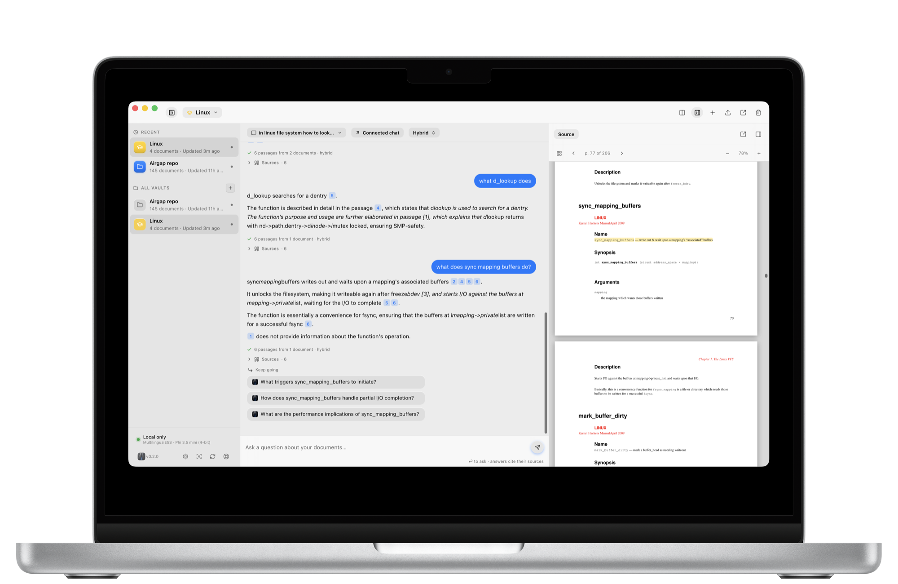

<div align="center">


# Airgap

**Local, on-device document RAG for macOS, Windows and Linux.**

Ask questions about your documents. Get precise answers with citations back to the page. Nothing leaves your machine unless you ask it to.

[](https://airgap.appgram.dev/download)
[](https://airgap.appgram.dev/download?platform=mac)
[](https://airgap.appgram.dev/download?platform=windows)
[](https://airgap.appgram.dev/download?platform=linux)

</div>

---

<div align="center">
<picture>
  <source media="(prefers-color-scheme: dark)" srcset="docs/screenshot-dark.png" />
  <source media="(prefers-color-scheme: light)" srcset="docs/screenshot-light.png" />
  
</picture>
</div>

---

## Demo

<div align="center">

<a href="https://www.youtube.com/watch?v=H0Fhbs4S4XY">
  
</a>

**[▶ Watch the demo](https://www.youtube.com/watch?v=H0Fhbs4S4XY)**

</div>

---

## What it is

Airgap is an offline document assistant. Point it at your PDFs, Markdown, or plain-text files and it builds a private index on your own machine. Questions are answered by a language model running locally, and every answer is grounded in passages you can click straight back to the source.

No accounts. No servers. No telemetry. The model, the index, and your documents all live on your machine, and the whole thing works with the network off.

## Highlights

- **On-device by default.** Ingest, embed, retrieve, and generate — all local. Works with Wi-Fi off.
- **Citations you can check.** Answers cite numbered passages, each with its file, page, and section, and the source pane jumps to the passage the answer used.
- **Bring your own model.** Llama 3.2, Qwen 2.5, Phi 3.5, and Gemma 2 are one click away, or point it at any GGUF on Hugging Face. Each is downloaded once and cached.
- **Reads what it is given.** PDFs, Markdown, and plain text.
- **Hybrid retrieval.** Semantic search and keyword search together, so a question phrased in your words still finds a passage phrased in the document's.
- **Multilingual.** Vaults are embedded with a multilingual model by default — documents in your own language are searched in your own language.
- **Shared vaults.** Publish a vault into a folder that OneDrive, Drive, Dropbox, SMB, Syncthing or a USB disk already syncs. Airgap reads and writes files and opens no sockets; the sync is your organisation's business.
- **Vault export / import.** Package a fully-indexed vault as a single file — the other side does not re-ingest.
- **Answers for your agents.** A local MCP server on `127.0.0.1` lets an MCP-aware tool search your vaults.

## Download

**[airgap.appgram.dev/download](https://airgap.appgram.dev/download)** picks the right build for your platform, or take one directly:

| Platform | File | |
|---|---|---|
| **macOS** | `Airgap_<version>_aarch64.dmg` | Signed and Apple-notarized — Gatekeeper lets it through on first launch. |
| **Windows** | `Airgap_<version>_x64-setup.exe` | Currently unsigned; see below. |
| **Linux** | `Airgap_<version>_amd64.AppImage`<br>`Airgap_<version>_aarch64.AppImage` | `.deb` packages are published beside them. |

Every build is on the [Releases page](https://github.com/appgram/airgap/releases) under a `desktop-v` tag.

> [!NOTE]
> The Windows build is not code-signed yet, so SmartScreen warns on first run. Choose **More info → Run anyway**.

## Requirements

| | |
|---|---|
| **macOS** | 13.4 (Ventura) or later, Apple Silicon. Intel Macs are not supported: the ONNX Runtime this build links against ships no Intel macOS binary, and the Apple Silicon one it does ship is built for 13.4. |
| **Windows** | 10 or 11, x64. Windows on ARM runs the x64 build under emulation. |
| **Linux** | x86-64 or arm64, with a WebKitGTK 4.1 runtime. The AppImage needs no install. |
| **Disk** | ~1 GB for the app and the embedding model, plus 1–3 GB for whichever language model you choose. |
| **Memory** | 8 GB works with a 1–3B model. More is only needed for larger models. |

## Models

Two models do the work, and both run on your machine.

**Retrieval** uses a 384-dimension embedding model, chosen per vault: *Multilingual E5 Small* (100 languages, the default) or *Arctic Embed S* (English). A vault remembers which one built it, because vectors from two different models are not comparable.

**Generation** is a 4-bit GGUF model run through llama.cpp, with Metal on macOS:

| | |
|---|---|
| Llama 3.2 | 1B and 3B |
| Qwen 2.5 | 3B |
| Phi 3.5 mini | |
| Gemma 2 | 2B |
| Custom | any GGUF from a Hugging Face repo |

## What leaves your machine

Nothing, by default — and the parts that could are worth naming precisely.

- **Documents, vectors, and answers never leave.** Retrieval and generation both run locally.
- **Models are downloaded once**, from Hugging Face, when you pick one. After that they are cached on disk and used offline.
- **Updates** are checked against this repository, and can be turned off.
- **A connected model is opt-in.** Airgap can be pointed at a hosted API instead of the local model, and if you do that your question and the retrieved passages go to that provider — that is the point of the setting. It is off unless you configure it, the app shows which chats use it, and the API key is held in the system credential store (Keychain on macOS, Credential Manager on Windows).

Vault contents are stored as ordinary files in the app's data directory and are **not** separately encrypted — they are protected by whatever full-disk encryption the machine uses (FileVault, BitLocker, LUKS). If that matters to your threat model, turn it on.

## Auto-updates

Airgap has a built-in updater. It reads a signed manifest:

```
https://appgram.github.io/airgap/desktop/latest.json
```

Every build in that manifest is signed with the release key, so a tampered update is refused.

## The macOS-only Swift app

Releases tagged `v0.3.1` and earlier are the original macOS-only app, built on MLX and Apple Intelligence with Sparkle updates. It has been replaced by the cross-platform app documented here, and is no longer developed. Its Sparkle feed (`docs/appcast.xml`) stays published so existing installs are not broken, but it will not receive new builds.

Vaults do not carry over automatically: a vault exported from the Swift app with encrypted sidecars needs re-exporting from 0.3.1 or newer before this app can read it.

## Support & feedback

Bug reports, feature requests, and general feedback:

<https://portal.appgram.dev/p/nfxai-ventures/airgap>

---

<div align="center">
<sub>Built by <a href="https://appgram.dev">Appgram</a> · Distributed by NFxAI Ventures</sub>
</div>
