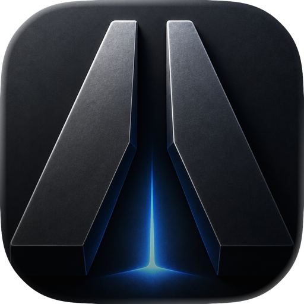
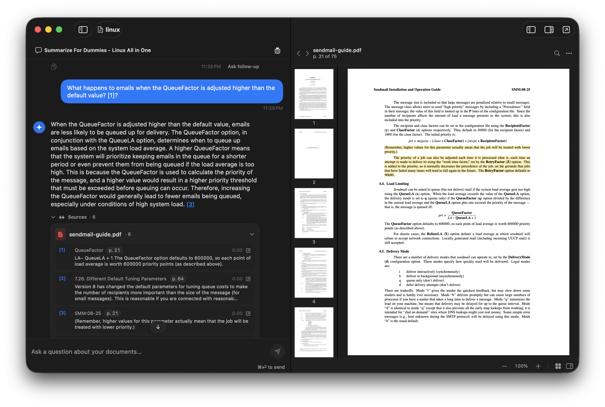

<div align="center">



# Airgap

**Local, on-device document RAG for macOS.**

Ask questions about your documents. Get precise answers with page-level citations. Nothing ever leaves your machine.

[](https://github.com/appgram/airgap/releases/latest)
[](https://www.apple.com/macos)
[](https://support.apple.com/en-us/HT211814)

</div>

---

<div align="center">

</div>

---

## Demo

<div align="center">

<a href="https://www.youtube.com/watch?v=H0Fhbs4S4XY">
  
</a>

**[▶ Watch the demo](https://www.youtube.com/watch?v=H0Fhbs4S4XY)**

</div>

---

## What it is

Airgap is a fully offline document assistant. Point it at your PDFs, Markdown, or plain-text files, and it builds a private vector index on your Mac. Your queries run against a local language model — either Apple Intelligence or an MLX model of your choice — and every answer is grounded in citations you can click straight back to the source page.

No accounts. No servers. No telemetry. The model, the index, and your documents all live on your machine.

## Highlights

- **100% on-device.** Ingest, embed, retrieve, and generate — all local. Works with Wi-Fi off.
- **Precise citations.** Answers cite specific paragraphs, with page numbers and bounding-box highlights on the PDF pane.
- **Bring your own model.** Run any MLX-compatible open-weight model locally (Llama, Qwen, Mistral, and more). On macOS 26 with Apple Intelligence enabled, the built-in system model works too.
- **Structure-aware ingest.** Understands headings, lists, tables, and figures — chunks respect document hierarchy.
- **Multi-format.** PDFs, Markdown, and plain text.
- **Encrypted vaults at rest.** Per-vault AES-GCM key stored in the macOS Keychain; sensitive sidecars are never written in the clear.
- **Vault export / import.** Package a fully-indexed vault as a shareable file — no re-ingest on the other side.
- **Vision OCR fallback.** Pages that PDFKit fails to extract get run through Apple's Vision framework automatically.

## Download

Grab the latest signed and Apple-notarized DMG from the [Releases page](https://github.com/appgram/airgap/releases/latest).

```
Airgap-<version>.dmg
```

Gatekeeper will let it through on first launch — no right-click-open required.

## Requirements

| |  |
|---|---|
| **macOS**  | 14.0 (Sonoma) or later |
| **Chip**   | Apple Silicon (M1 or newer) |
| **Disk**   | ~2 GB free for the app + embedding model; more if you load a large MLX model |

**Language-model backend.** Airgap runs MLX models on any supported Mac (macOS 14+) — pick from Llama, Qwen, Mistral, and other open-weight models; each is downloaded once and cached locally. On **macOS 26** with Apple Intelligence enabled, the built-in Apple system model is available as an additional zero-download backend.

## Auto-updates

Airgap ships with an in-app updater powered by [Sparkle](https://sparkle-project.org). Updates are opt-in — enable them from Settings on first launch.

Appcast feed:

```
https://appgram.github.io/airgap/appcast.xml
```

Every build in the feed is signed with the same Developer ID key that signs the app, so tampered updates are refused.

## Support & feedback

Bug reports, feature requests, and general feedback:

<https://portal.appgram.dev/p/nfxai-ventures/airgap>

---

<div align="center">
<sub>Built by <a href="https://appgram.dev">Appgram</a> · Distributed by NFxAI Ventures</sub>
</div>
